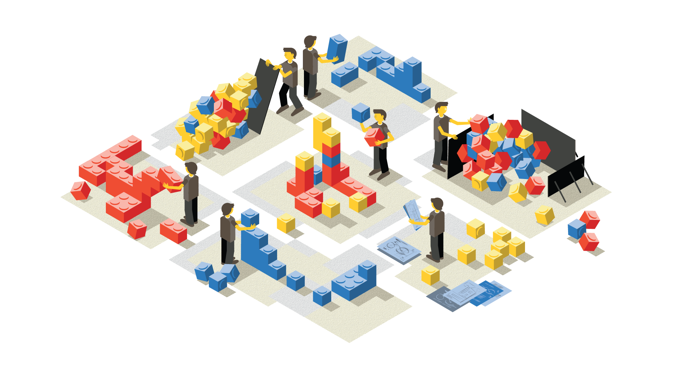
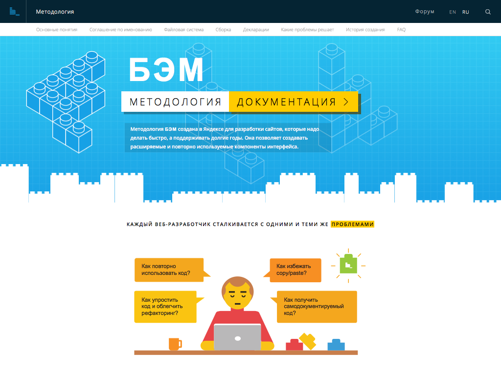

---

layout: default

---

# Яндекс

## **{{ site.presentation.title }}** {#cover}

    
{{ site.presentation.service }}





	
{{ site.author.name }},   {{ site.author.position }}

## Страхи

* Всё или ничего
* ...Кажется сложно!
* ...Только для больших проектов
* ...Не принесёт пользу в моём окружении

## **БЭМ — это просто!**
<footer>
    И сейчас разберём на примерах почему это именно так.
</footer>

## **<del>Всё или ничего</del> Используй по частям**

## ****
{:.cover}

## ****
{:.cover}

<footer>
* Методология
* Библиотеки блоков
* БЭМ в JS
* БЭМ в шаблонах
* Сборка с учетом БЭМ-специфики

И все это в любых сочетаниях с любыми фреймворками и языками программирования.
</footer>

## Методология — просто

* Полностью переписали методологический раздел
* ...Избавились от любых отсылок к нашей конкретной реализации
* ...Не навязываем ни строчки готового кода
* ...Не заставляем использовать
   - конкретные схемы подчеркиваний
   - ...или расположения блоков на файловой системе
* ...Объясняем зачем и какую пользу нанесет вашему проекту

## ****
{:.cover}

## **[bem.info/ method](https://ru.bem.info/method/)**

## <del>Всё или ничего</del> Модульная методология
* Соглашение по именованию
* Файловая система
* Сборка
* Декларации

<footer>
    И сам раздел Методология разбит на отдельные части и вы можете использовать лишь то, что вам действительно нужно.
</footer>

## **Суть методологии&nbsp;— компонентный подход**

## **Суть методологии&nbsp;— компонентный подход**

<footer>
    Еще раз проговорю важную мысль: нет необходимости использовать какие-либо библиотеки/модули/технологии/инструменты/etc, чтобы получать пользу от использования БЭМа.
</footer>

## Библиотеки блоков легко

* Всего два файла и используй
* Не зависят от бекенда
* Работают с любыми фреймворками

<footer>
    Как бутстрап
</footer>

## **[Demo](https://jsfiddle.net/tadatuta/jfztfdjo/)**

## **JavaScript по БЭМ&nbsp;— тоже легко**

<footer>
    Следующая часть БЭМ — это история про JS.
    Теперь, когда мы знаем, что БЭМ позволяет использовать термины блоков, элементов и модификаторов не только для обеспечения пуленепробиваемого CSS, но и для компонентного подхода в разметке, у вас должно появиться желание использовать эти же термины в JS.
</footer>

## Декларативное описание состояния

~~~ css
.button {
    border-radius: 5px;
}

.button_disabled {
    opacity: .5;
}
~~~

## Декларативное описание состояния

~~~ javascript
BEMDOM.decl('button', {

});
~~~

## Декларативное описание состояния

~~~ javascript
BEMDOM.decl('button', {
    onSetMod: {

    }

});
~~~

## Декларативное описание состояния

~~~ javascript
BEMDOM.decl('button', {
    onSetMod: {
        disabled: {

        }
    }

});
~~~

## Декларативное описание состояния

~~~ javascript
BEMDOM.decl('button', {
    onSetMod: {
        disabled: {
            true: { this._onDisabled(); }

        }
    },
    _onDisabled: function() {}

});
~~~

## Декларативное описание состояния

~~~ javascript
BEMDOM.decl('button', {
    onSetMod: {
        disabled: {
            true: { this._onDisabled(); },
            '': { this._onEnabled(); }
        }
    },
    _onDisabled: function() {},
    _onEnabled: function() {}
});
~~~

<footer>
    Под декларативностью здесь я подразумеваю такой способ описания поведения блоков, когда вы, как в CSS, задаете правила, кторые должны примениться к блоку в момент появления модификатора или при его снятии (когда на DOM-узле появляется/исчезает новый класс — стили с селектором на него автоматически применяются браузером).
</footer>

## Уровни переопределения

~~~ css
.button {
    width: 200px;
    color: red;
}
~~~

<footer>
    При чем мы хотим сохранить возможность гибко до- и переопределять любые свойства и методы блоков.
</footer>

## Уровни переопределения

~~~ css
.button {
    width: 200px;
    color: red;
}

.button {
    height: 50px;
    color: green;
}
~~~

## **Шаблонизация**

<footer>Предлагаю начать с шаблонизатора. Но начнем издалека.</footer>

## Инлайновые стили

~~~ xml

~~~

<footer>
    Сегодня всем очевидно, в чем проблема инлайновых стилей.

    Хотя казалось бы: все в одном файле, все рядом, не приходится в голове матчить селекторы на ноды. Тем не менее, все используют внешние CSS для стилизации DOM-дерева.

    Так почему тогда никого не беспокоит необходимость «инлайнить» разметку?
</footer>

## Инлайновый HTML

~~~ xml
<form class="form" action="/" method="post">
    <input class="form__input" type="search">
    <input class="form__button" type="submit" value="Отправить">
</form>

~~~

<footer>
    Здесь знание про теги, классы и прочие атрибуты зашиты прямо в структуре дерева.
</footer>

## Семантическое дерево

~~~
form
    input
    button
        Отправить

~~~

<footer>
    Ведь на самом деле сематически эту форму было бы логично представить деревом вида
</footer>

## BEMJSON

~~~ javascript
{
    block: 'form',
    content: [
        { elem: 'input' },
        {
            elem: 'button',
            content: 'Отправить'
        }
    ]
}
~~~

<footer>
    или, если записать это же в JS

    А тот факт, что блок `form` должен быть представлен тегом `form` с необходимыми классами и атрибутами, равно как и элементы `input` и `button` — это задача шаблонизатора. При чем на странице (или разных страницах проекта) может оказаться несколько форм и было бы удобно, чтобы все они, в точности как с помощью CSS, одинаково шаблонизировались.
</footer>

## **[BEMHTML](http://goo.gl/jbCxwm)**

http://goo.gl/jbCxwm

## **[bem-components и шаблоны](https://jsfiddle.net/tadatuta/jfztfdjo/)**

<footer>
    Изучив возможности BEMHTML, вы можете не только применять его для своих собственных блоков, но и по-новому использовать bem-components, ведь библиотека написана с использованием этого шаблонизатора.
</footer>

## **Бесплатное обновление**

## ****
{:.cover}

## ****
{:.cover}

<footer>
    Здесь мы видим одно из принципиальных преимуществ по сравнению с альтернативными библиотеками компонентов.
    Если в новой версии `bem-components` изменится разметка, вам не придется ничего менять (кроме чиселки в bower.json) — актуальный HTML сгенерируется на основе BEMJSON автоматически.
</footer>

## **Вот и всё**

<footer>
    До сих пор мы отлично пользовались всеми технологиями БЭМ-платформы без каких-либо инструментов и сборки.
    На этом можно было бы закончить, но...
</footer>

## **Сборка**

<footer>
    Конечно, ни один сколько-нибудь серьезный проект на сегодняшний без уже невозможно представить без сборки. А в БЭМ мы начали раскладывать блоки по отельным папкам и уровням переопределения, когда это еще не было модным.

    Поэтому, если вы хотите воспользоваться максимальным количеством возможностей, сборка все-таки потребуется.
</footer>

## Сборка

* bem-tools
* ...ENB

<footer>
    Наверняка вы слышали о наборе инструментов под называнием `bem-tools`, который появился задолго до gulp или Webpack, главная задача которого была как раз сборка с учетом таких специфичных для БЭМ особенностей, как уровни переопределения и специальная технология для указания зависимостей между сущностями (блоками, элементами и модификаторами).

    Наверняка вы слышали, что пользоваться этим набором сложно.

    Возможно, вы даже пробовали и вам действительно было сложно.

    Возможно, вы даже слышали про ENB. И с ним была такая же история.
</footer>

## Сборка

* <del>bem-tools</del>
* <del>ENB</del>
* [github.com/gulp-bem](https://github.com/gulp-bem/gulp-bem/)

<footer>
    Но! Как мы и обещали, этот доклад про БЭМ без `bem-tools`.
    Поэтому собирать проекты на БЭМ сейчас можно с помощью gulp или Webpack.
</footer>

## Итог

* Методология != реализация
* ...Можно использовать только методологию
* ...Библиотеки — подключил и работает
* ...Шаблонизатор не требует сборки
* ...БЭМ в JS можно писать хоть в `JSFiddle`.
* ...И вообще `bem-tools` умер в пользу модульной сборки ;)

## **And one more thing**

## **[bem-tools 2.0](https://github.com/bem/bem-tools/blob/WIP/index.js)**

## **Ваши вопросы!**

## **Контакты** {#contacts}

{{ site.author.name }}

 
<!-- 
{{ site.author.position }}
 -->

    

        
bem.info

        
info@bem.info

        
bem_ru&nbsp;&nbsp;&nbsp;&nbsp;#b_

        <!-- 
vk
 -->
        <!-- 
facebook
 -->
    

